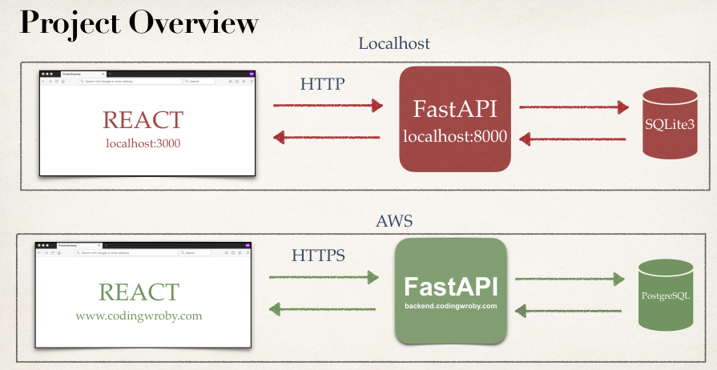
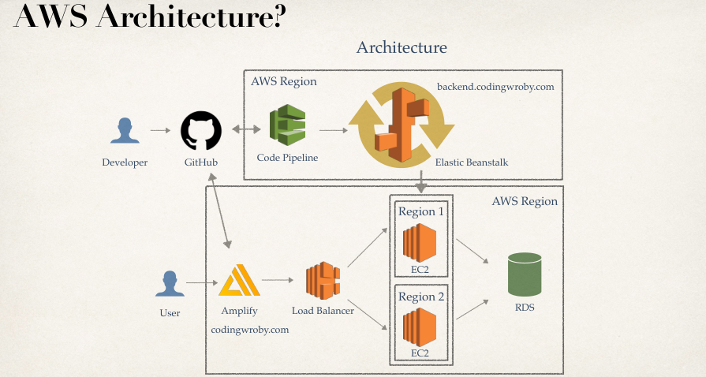

# fastapi-aws

  Course Udemy Deploy a Full Stack app on AWS that is scalable, uses a custom domain, SSL, HTTPS, Continuous Integration and Delivery  

## Project Overview

## AWS Architecture

## Technologies - Run Project Locally & Course Setup

We really need 3 things to get the project running locally.

- Python Installed
  - FastAPI

      is a high-performance web framework for building HTTP-based service APIs in Python 3.8+. It uses Pydantic and type hints to validate, serialize, and deserialize data. FastAPI also automatically generates OpenAPI documentation for APIs built with it

- Node Installed
- Visual Studio Code Installed
- Git Installed
- GitHub account

### Accomplishments

- Deploy FastAPI + PostgreSQL application
- Setup CI/CD
- Setup Custom Domain
- Setup SSL / HTTPS
- Create Load Balancer for our FastAPI application
- Deploy React application
